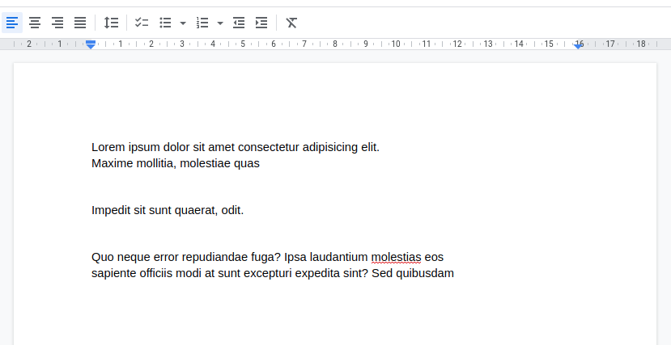
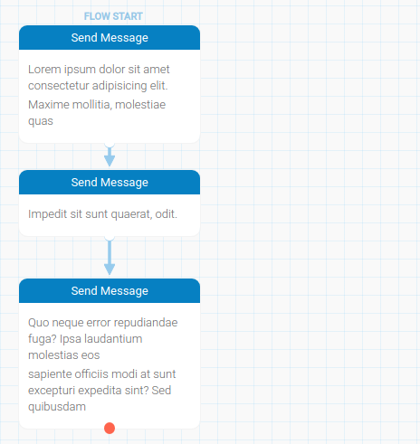

<h1 align="center">Convert2flow</h1>

<!-- Status -->

<h4 align="center"> 
	🚧  Convert2flow 🚀 Under construction...  🚧
</h4> 

<hr>

<br>

## About ##

This is a CLI application write in Go to convert text files in a json file that can be imported in RapidPro to generate a new flow

## Features ##

 - Convert from docx;
 - Convert from txt;
 - Convert from csv;

## Utilization ##

```bash
# Clone this project
$ git clone https://github.com/rasoro/convert2flow

# Access
$ cd convert2flow

# execute with go run
$ go run main.go from-txt source-file.txt

# flow_import.json file will be generated in current directory
```

or

```bash
# Clone this project
$ git clone https://github.com/rasoro/convert2flow

# Access
$ cd convert2flow

# build project
$ go build

# execute with go run
$ ./convert2flow from-txt source-file.txt

# flow_import.json file will be generated in current directory
```
#### Source
(the text blocks must be separated by 2 blank new line)

#### Result after import in Rapidpro
(every text block will generate one send message node)


## Commands

`from-docx`: generate a import_flow.json from a docx file.

`from-txt`: generate a import_flow.json from a txt file.

`from-csv`: generate a import_flow.json from a csv file.

## License ##

This project is under license from Apache v2. For more details, see the [LICENSE](LICENSE) file.

&#xa0;

<a href="#top">Back to top</a>
